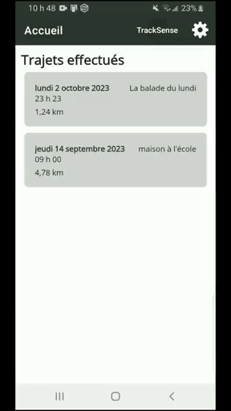

# TrackSense - Application mobile

> Ce dépôt fait parti du projet [TrackSense](https://github.com/DFC-Informatique-Cegep-de-Sainte-Foy/TrackSense) développé par des étudiants du programme [Techniques de l'informatique - Programmation, bases de données et serveurs](https://dfc.csfoy.ca/retourner-aux-etudes/programmes-a-temps-plein/informatique/techniques-de-linformatique-programmation-bases-de-donnees-et-serveurs-dec-accelere/) du cégep de Ste-Foy, dans le cadre de leur projet de synthèse.

L'application mobile TrackSense permet de communiquer avec un objet connecté qui mesure votre position GPS et d'autres données sur vos trajets à vélo ou à pied. Les données d'un trajet peuvent être envoyées à l'application mobile via Bluetooth. L'application mobile permet d'enregistrer ces données dans une base de données. Elle permet aussi de consulter les informations sur vos trajets, notamment votre parcours dessiné sur une carte et des statistiques sur votre parcours.

Vous trouverez une procédure d'installation et des détails sur la conception de l'application dans le [wiki](../../wiki/).

  

# Bibliothèques
- Bluetooth: [dotnet-bluetooth-le](https://github.com/dotnet-bluetooth-le/dotnet-bluetooth-le/tree/master)
- Carte: [Mapsui](http://mapsui.com/documentation/getting-started-maui.html)

# Débogage

## Android

Il y a plusieurs solutions pour déboguer une application Android :

### Émulateur

|Avantage                |Désavantage                   |
|------------------------|------------------------------|
|Facile à mettre en place|Problèmes avec le bluetooth   |
|                        |Consomme beaucoup de ressource|

### Sous-système Windows pour Android (WSA) :

- Documentation : https://learn.microsoft.com/fr-fr/windows/android/wsa/
- Vidéo : https://www.youtube.com/watch?v=QpNYzigUdfg&ab_channel=JamesMontemagno
- Barista (Extension VS) : https://marketplace.visualstudio.com/items?itemName=Redth.WindowsSubsystemForAndroidVisualStudioExtension

|Avantage                               |Désavantage                |
|---------------------------------------|---------------------------|
|Lancement rapide (surtout avec Barista)|Requiert Windows 11        |
|                                       |Problèmes avec le bluetooth|

### Appareil Android local

- Documentation : https://developer.android.com/studio/debug/dev-options?hl=fr

|Avantage                |Désavantage                 |
|------------------------|----------------------------|
|Lancement rapide        |Requiert un appareil Android|
|Bluetooth fonctionnel   |                            |
|Facile à mettre en place|                            |

